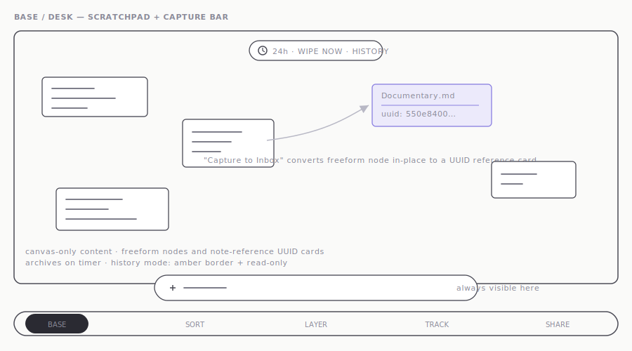
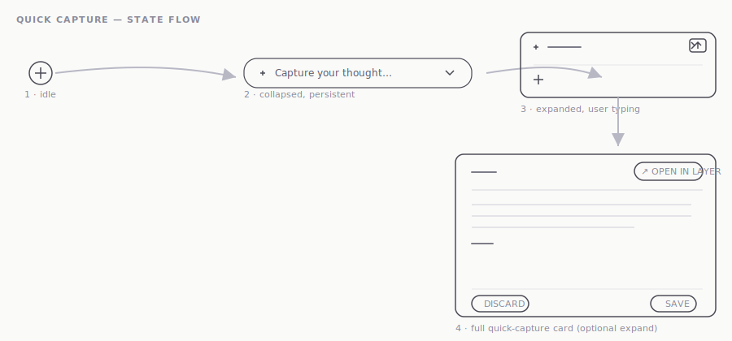
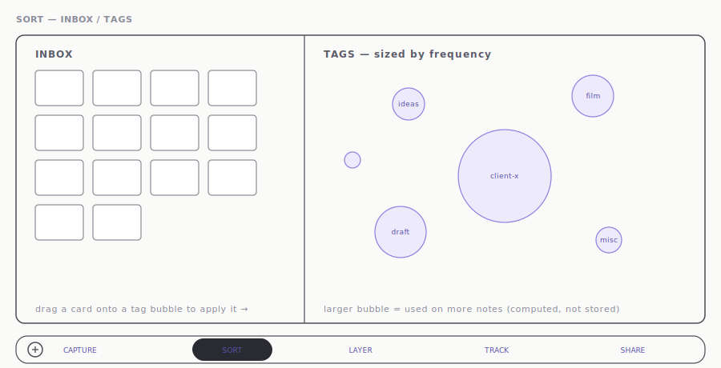
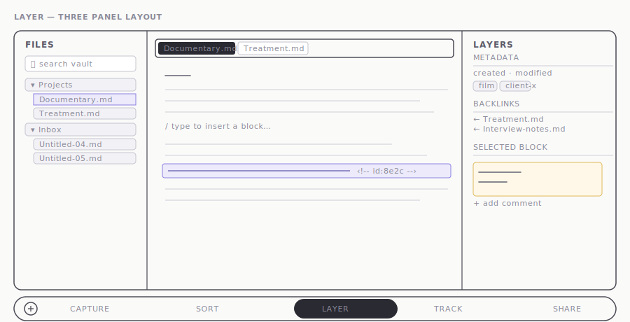
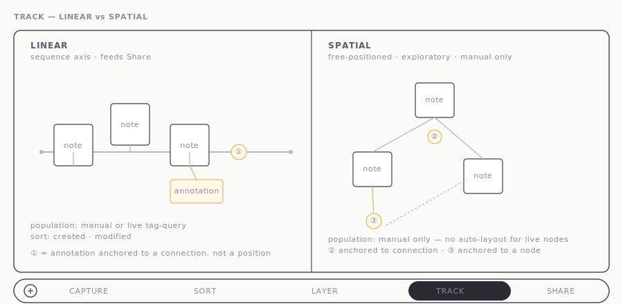
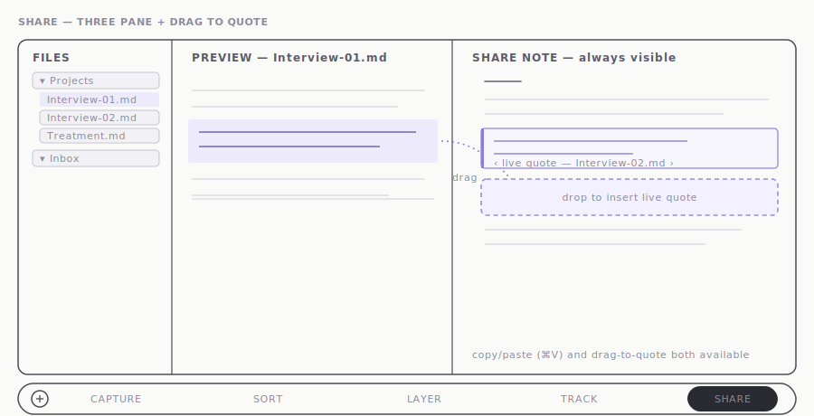

# Wireframes

Reference sketches for all views, recreated from early hand drawings (June 2026). These are early reference points, not final UI — they will be superseded by Figma hi-fi designs.

---

## Base / Desk — Scratchpad + Capture Bar

*Scratchpad canvas with freeform nodes, note-reference UUID cards, timer pill, and persistent capture bar.*

---

## Capture — Quick Capture State Flow

*Quick capture state flow — idle → collapsed → expanded → Quick Look modal.*

---

## Sort — Inbox + Tag Frequency Bubbles

*Inbox grid and tag-frequency bubbles. Larger bubble = more notes carrying that tag.*

---

## Layer — Three Panel Layout

*Three-panel editor — file navigator, block-typed editor with tabs, layers panel with metadata and comments.*

---

## Track — Linear vs Spatial Modes

*Linear vs Spatial layout modes. Annotations anchored to nodes or connections.*

---

## Share — Three Pane + Drag to Quote

*Three-pane composition — file navigator, preview pane, Share note. Drag-to-quote interaction shown mid-gesture.*

---

